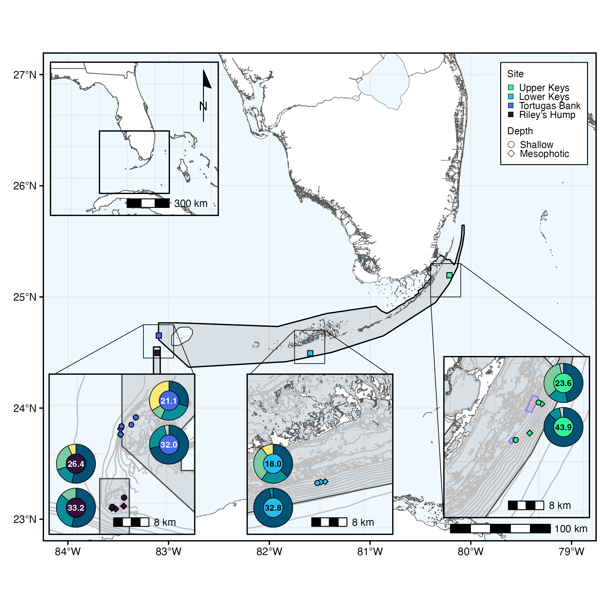

# Stephanocoenia_FKNMS_PopGen

### Ryan Eckert -- <ryan.j.eckert@gmail.com>
### [ryanjeckert.weebly.com](https://ryanjeckert.weebly.com)
### version: September 27, 2022

------------------------------------------------------------------------
This repository contains scripts and data associated with the
publication:

**[XXX](https://)**

------------------------------------------------------------------------
Population genetic analyses can provide useful data on species’ regional connectivity and diversity which can inform conservation and restoration efforts. In this study, we quantified the genetic connectivity and diversity of *Stephanocoenia intersepta* corals from shallow (<30 m) to mesophotic (30–45 m) depths across Florida Keys National Marine Sanctuary (FKNMS). Using 2bRAD-seq methods, we generated a suite of >24,000 single nucleotide polymorphism (SNP) markers to identify genetic structuring of shallow and mesophotic *S. intersepta* populations. We estimated recent genetic migration rates and determined that mesophotic populations were relatively larger sources than shallow populations, particularly in the Lower Keys and Tortugas Bank. Throughout the region, shallow *S. intersepta* populations exhibited lower heterozygosity and higher minor allele frequencies of outlier SNP loci. Shallow *S. intersepta* populations also exhibited significantly higher levels of intrapopulation relatedness and inbreeding relative to mesophotic populations, providing potential evidence of co-recruitment of sibling groups, or “sweepstakes reproductive success”. Additionally, Symbiodiniaceae communities among *S. intersepta* populations were compared using the *ITS2* region and SymPortal analysis framework. We identified Symbiodiniaceae from the genera *Symbiodinium*, *Breviolum*, and *Cladocopium*. Symbiodiniaceae communities varied significantly across depth and location and were loosely correlated with host population structure and genotype. Together, these data demonstrate that despite population genetic structuring across depth, mesophotic populations may provide refuge potential for shallow populations moving forward and remain important contributors to the overall genetic diversity of this species throughout the region. This study highlights the importance of including mesophotic as well as shallow coral populations in population genetic assessments and provides information and data useful for future management and restoration efforts within the FKNMS.

------------------------------------------------------------------------

2bRAD Lab protocols adapted from [Misha Matz](https://docs.google.com/document/d/1am7L_Pa5JQ4sSx0eT5j4vdNPy5FUAtMZRsJZ0Ar5g9U/edit?usp=sharing)
ITS2 lab protocols adapted from [Eckert et al. 2020](https://doi.org/10.3389/fmicb.2020.00518) and [Klepac et al. 2015](https://doi.org/10.3354/meps11369)

------------------------------------------------------------------------

#### Protocols and walkthroughs accompanying this manuscript:

1.  [Protocol for DNA extraction](https://ryaneckert.github.io/labProtocols/dnaExtraction/)
2.  [Protocol for 2bRAD wet lab (based on https://github.com/z0on/2bRAD_denovo)](https://ryaneckert.github.io/labProtocols/2bRAD/)
3.  [Protocol for Symbiodiniaceae ITS2 wetlab](https://ryaneckert.github.io/labProtocols/its2/)
4.  [2bRAD denovo analysis (adapted from https://github.com/z0on/2bRAD_denovo)](https://ryaneckert.github.io/Stephanocoenia_FKNMS_PopGen/data/)
5.  [Statistical analysis of SNP and ITS2 data](https://ryaneckert.github.io/Stephanocoenia_FKNMS_PopGen/code/)

------------------------------------------------------------------------
