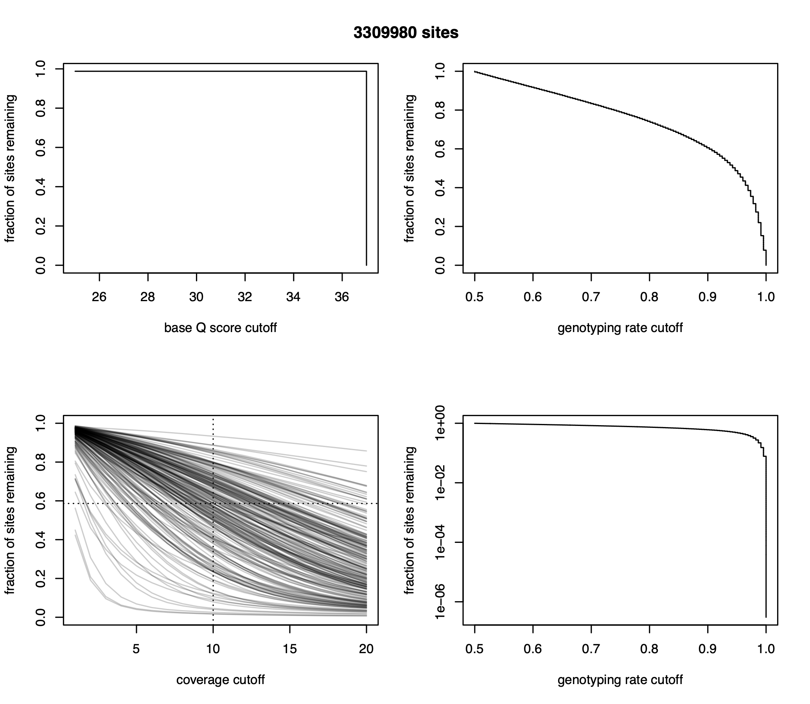

<a href="https://github.com/RyanEckert/Stephanocoenia_FKNMS_PopGen" class="github-corner" aria-label="View source on GitHub"><svg width="80" height="80" viewBox="0 0 250 250" style="fill:#2C3E50; color:#fff; position: absolute; top: 0; border: 0; right: 0;" aria-hidden="true"><path d="M0,0 L115,115 L130,115 L142,142 L250,250 L250,0 Z"></path><path d="M128.3,109.0 C113.8,99.7 119.0,89.6 119.0,89.6 C122.0,82.7 120.5,78.6 120.5,78.6 C119.2,72.0 123.4,76.3 123.4,76.3 C127.3,80.9 125.5,87.3 125.5,87.3 C122.9,97.6 130.6,101.9 134.4,103.2" fill="currentColor" style="transform-origin: 130px 106px;" class="octo-arm"></path><path d="M115.0,115.0 C114.9,115.1 118.7,116.5 119.8,115.4 L133.7,101.6 C136.9,99.2 139.9,98.4 142.2,98.6 C133.8,88.0 127.5,74.4 143.8,58.0 C148.5,53.4 154.0,51.2 159.7,51.0 C160.3,49.4 163.2,43.6 171.4,40.1 C171.4,40.1 176.1,42.5 178.8,56.2 C183.1,58.6 187.2,61.8 190.9,65.4 C194.5,69.0 197.7,73.2 200.1,77.6 C213.8,80.2 216.3,84.9 216.3,84.9 C212.7,93.1 206.9,96.0 205.4,96.6 C205.1,102.4 203.0,107.8 198.3,112.5 C181.9,128.9 168.3,122.5 157.7,114.1 C157.9,116.9 156.7,120.9 152.7,124.9 L141.0,136.5 C139.8,137.7 141.6,141.9 141.8,141.8 Z" fill="currentColor" class="octo-body"></path></svg></a><style>.github-corner:hover .octo-arm{animation:octocat-wave 560ms ease-in-out}@keyframes octocat-wave{0%,100%{transform:rotate(0)}20%,60%{transform:rotate(-25deg)}40%,80%{transform:rotate(10deg)}}@media (max-width:500px){.github-corner:hover .octo-arm{animation:none}.github-corner .octo-arm{animation:octocat-wave 560ms ease-in-out}}</style>


```{r setup, include=FALSE}
knitr::opts_chunk$set(echo = TRUE, eval = FALSE)
```

#### version: `r library(magrittr)` `r Sys.Date() %>% format(format="%B %d, %Y")`

#### [GitHub repository](https://github.com/RyanEckert/Stephanocoenia_FKNMS_PopGen.git){target="_blank"}

## A B O U T &nbsp; T H I S &nbsp; D O C U M E N T

This walks through the steps to process 2bRAD reads without an existing genome.

Be sure to read through what you are doing and follow instructions before copy/pasting code chunks.

Copy the code chunks into your terminal, taking care to change the necessary portions to fit your data/ your directory structure, etc.

First, you will need to replace ```reckert2017``` with your user name and ```reckert2017@fau.edu``` with your email throughout this code.

***

## S E T U P 
***

Download all necessary scripts and load modules for processing/analysis

### Login to KoKo
```{r, login}
ssh reckert2017@koko-login.hpc.fau.edu

```

### Load necessary modules 
or you can add to ~/.bashrc to load at login (use ```nano .bashrc```)
```{bash, load modules}
module load angsd-0.933-gcc-9.2.0-65d64pp
module load bayescan-2.1-gcc-8.3.0-7gakqmd
module load qt-5.15.2-gcc-9.2.0-zi7wcem BayeScEnv/1.1
module load bcftools-1.9-gcc-8.3.0-il4d373
module load bowtie2-2.3.5.1-gcc-8.3.0-63cvhw5
module load cdhit-4.8.1-gcc-8.3.0-bcay75d
module load htslib-1.9-gcc-8.3.0-jn7ehrc
module load kraken2-2.1.1-gcc-9.2.0-ocivj3u
module load python-3.7.4-gcc-8.3.0-3tniqr5
module load launcher
module load miniconda3-4.6.14-gcc-8.3.0-eenl5dj
module load ncbi-toolkit-22_0_0-gcc-9.2.0-jjhd2wa
module load ngsadmix-32-gcc-8.3.0-qbnwmpq
module load ngsRelate/v2
module load R/3.6.1
module load samtools-1.10-gcc-8.3.0-khgksad
module load vcftools-0.1.14-gcc-8.3.0-safy5vc

```

### Download scripts 
Put scripts needed into ~/bin or similar directory that is mapped in .bashrc path
IF you don't have a ```bin``` directory in your ```$HOME``` you can make one now (```mkdir ~/bin```) 
```{bash, download scripts}
cd ~/bin
svn checkout https://github.com/RyanEckert/Stephanocoenia_FKNMS_PopGen/trunk/scripts/
mv scripts/* .
rm scripts

wget http://www.cmpg.unibe.ch/software/PGDSpider/PGDSpider_2.0.7.1.zip
unzip PGDSpider_2.0.7.1.zip
rm PGDSpider_2.0.7.1.zip

```

Make all scripts executable
```{bash, scripts +x}
chmod +x *.sh *.pl *.py

```

IF not already, it is useful to add ```~/bin``` to your ```$PATH``` <br>
This way you can easily access your executable scripts without specifying the absolute path to them. <br>
Otherwise skip to "Build working directory"
```{bash, bin path}
PATH="$HOME/bin:$PATH";

```

To permanently add this to your ```$PATH``` add to ```.bashrc``` use ```nano``` text editor

```{bash, bashrc}
nano ~/.bashrc

```

ADD the following text to file under PATHS section if in your .bashrc:
```export PATH="$HOME/bin:$PATH";``` <br>
exit nano with ctrl+x

```{bash, source bashrc}
source ~/.bashrc
echo $PATH

```

### Build working directory
```{bash, wd}
cd
mkdir 2bRAD/sint/
mkdir 2bRAD/sint/fknms/
mkdir 2bRAD/sint/fknms/rawReads/
cd 2bRAD/sint/fknms/rawReads/

```
<br>

## D O W N L O A D &nbsp; R E A D S 
***

### Download and concatenate raw reads from BaseSpace

If you have not previously, download BaseSpaceCLI
```{bash, bs dl}
wget "https://launch.basespace.illumina.com/CLI/latest/amd64-linux/bs" -O $HOME/bin/bs

chmod +x ~/bin/bs

```

Go to the website and confirm authorization by logging in to your basespace acct.
```{bash, bs}
bs auth

```

Making a script to download the reads and merge samples across 2 NovaSeq lanes
```{bash, download}

echo '#!/bin/bash' > downloadReads.sh
echo 'bs download project --concurrency=high -q -n JA21001 -o .' >> downloadReads.sh
# -n is the project name and -o is the output directory

echo "find . -name '*.gz' -exec mv {} . \;" >> downloadReads.sh
echo 'rmdir SA*' >>downloadReads.sh
echo 'mkdir ../concatReads' >> downloadReads.sh
echo 'cp *.gz ../concatReads' >> downloadReads.sh
echo 'cd ../concatReads' >> downloadReads.sh
echo 'mergeReads.sh -o mergeTemp' >> downloadReads.sh
# -o is the directory to put output files in

echo 'rm *L00*' >> downloadReads.sh
echo "find . -name '*.gz' -exec mv {} . \;" >> downloadReads.sh
echo 'gunzip *.gz' >> downloadReads.sh
echo 'rmdir mergeTemp' >> downloadReads.sh

chmod +x downloadReads.sh

launcher_creator.py -b 'srun downloadReads.sh' -n downloadReads -q shortq7 -t 06:00:00 -e reckert2017@fau.edu
sbatch downloadReads.slurm

```
<br>

How many reads before filtering?
```{bash, read counts}
echo '#!/bin/bash' >rawReads
echo readCounts.sh -e .fastq -o sintRaw >>rawReads

sbatch -o rawReads.o%j -e rawReads.e%j rawReads --mail-type=ALL --mail-user=reckert2017@fau.edu

```

## T R I M M I N G &nbsp; & &nbsp; F I L T E R I N G
***

### Trim and demultiplex reads
```{bash, trim}
cd ../concatReads

2bRAD_trim_launch_dedup.pl fastq > trims.sh
launcher_creator.py -j trims.sh -n trims -q shortq7 -t 06:00:00 -e reckert2017@fau.edu
sbatch --mem=200GB trims.slurm

```

Check that we have the correct number of trim files (226 in this case)
```{bash, check count}
ls -l *.tr0 | wc -l

mkdir ../trimmedReads
srun mv *.tr0 ../trimmedReads &

zipper.py -f fastq -a -9 --launcher -e reckert2017@fau.edu
sbatch --mem=200GB zip.slurm

cd ../trimmedReads
```

Rename sequence files using sampleRename.py
This script needs a .csv with XXX
Make sure you use the reverse complement of your inline BCs!
```{bash, remame py}
srun sampleRename.py -i sampleList -n fk_ -f tr0

```

### Quality filtering using cutadapt
I can't get KoKo's module for cutadapt to work, so we'll do it in miniconda.
Run below if you don't have a conda env. set up, otherwise you can skip to the next chunk
```{bash, conda}
module load miniconda3-4.6.14-gcc-8.3.0-eenl5dj
conda config --add channels defaults
conda config --add channels bioconda
conda config --add channels conda-forge
conda create -n 2bRAD cutadapt

```

Removing reads with qualities at ends less than Q15 for de novo analysis
```{bash, low q reads}
source activate 2bRAD

echo '#!/bin/bash' > trimse.sh
echo 'module load miniconda3-4.6.14-gcc-8.3.0-eenl5dj' >> trimse.sh
echo 'source activate 2bRAD' >> trimse.sh
for file in *.tr0; do
echo "cutadapt -q 15,15 -m 36 -o ${file/.tr0/}.trim $file > ${file/.tr0/}.trimlog.txt" >> trimse.sh;
done

```

I can't get it to run through launcher so just run it serially, it takes a while to run, so consider breaking up in several jobs.
```{bash launch trims}
sbatch -o trimse.o%j -e trimse.e%j --mem=200GB trimse.sh

```

Do we have expected number of *.trim files created?
```{bash, trim files}
conda deactivate 2bRAD
ls -l *.trim | wc -l

```

How many reads in each sample?
```{bash, readcounts}
echo '#!/bin/bash' >sintReads
echo readCounts.sh -e trim -o sintFilt >>sintReads
sbatch --mem=200GB sintReads

mkdir ../filteredReads
mv *.trim ../filteredReads

zipper.py -f tr0 -a -9 --launcher -e reckert2017@fau.edu
sbatch zip.slurm

cat sintFiltReadCounts

```
<br>

## D E N O V O &nbsp; R E F E R E N C E 
***

Construct denovo reference for aligning reads                              

### Remove symbiodiniaceae reads
If you've not already, build a bt reference for the concatenated zoox genomes, otherwise skip ahead to the next chunk
```{bash, symbiont genomes}
mkdir ~/bin/symGenomes
cd ~/bin/symGenomes
echo "bowtie2-build symbConcatGenome.fasta symbConcatGenome" > bowtie2-build
launcher_creator.py -j bowtie2-build -n bowtie2-build -q shortq7 -t 06:00:00 -e reckert2017@fau.edu
module load bowtie2-2.3.5.1-gcc-8.3.0-63cvhw5
sbatch --mem=200GB bowtie2-build.slurm
module load samtools-1.10-gcc-8.3.0-khgksad
srun samtools faidx symbConcatGenome.fasta

```

Mapping reads to concatenated Symbiodinaceae genome
```{bash, map zoox}
cd ~/2bRAD/past/sefl/filteredReads

mkdir symbionts
SYMGENOME=~/bin/symGenomes/symbConcatGenome

2bRAD_bowtie2_launcher.py -g $SYMGENOME -f .trim -n zooxMaps --split -u un -a zoox --aldir symbionts --launcher -e reckert2017@fau.edu

sbatch zooxMaps.slurm

```

Checking Symbiodiniaceae read mapping rates
```{bash, zoox alignments}
>zooxAlignmentRates
for F in `ls *trim`; do
M=`grep -E '^[ATGCN]+$' $F | wc -l | grep -f - zooxMaps.e* -A 4 | tail -1 | perl -pe 's/zooxMaps\.e\d+-|% overall alignment rate//g'` ;
echo "$F.sam $M">>zooxAlignmentRates;
done

# ls *trim | cut -d '.' -f 1 >align1
# grep "% overall" zooxMaps.e* | cut -d ' ' -f 1 >align2
# paste <(awk -F' ' '{print $1}' align1) <(awk -F' ' '{print $1}' align2) >zooxAlignmentRates
# rm align1 align2

less zooxAlignmentRates

```

Clean up directory
```{bash, clean up zoox}
zipper.py -f .trim -a -9 --launcher -e reckert2017@fau.edu
sbatch --mem=200GB zip.slurm

mv *.sam symbionts/

cd ~/2bRAD/sint/fknms/
mv filteredReads/symbionts .
```

### Uniquing reads 
'stacking' individual trimmed fastq reads:
```{bash, denovo construction}
cd filteredReads
ls *.trim.un | perl -pe 's/^(.+)$/uniquerOne.pl $1 >$1\.uni/' > unique

launcher_creator.py -j unique -n unique -q shortq7 -t 06:00:00 -e reckert2017@fau.edu
sbatch --mem=200GB unique.slurm
```

Checking there is a .uni for all samples
```{bash, uni check}
ls -l *.uni | wc -l

```

### Collecting common tags (major alleles).
Merging uniqued files (set minInd to >10, or >10% of total number of samples, whichever is greater).
```{bash, }
echo 'mergeUniq.pl uni minInd=30 > all.uniq' > allunique

launcher_creator.py -j allunique -n allunique -q shortq7 -t 06:00:00 -e reckert2017@fau.edu
sbatch --mem=200GB allunique.slurm

```

Discarding tags that have more than 7 observations without reverse-complement
```{bash, discard tags}
srun awk '!($3>7 && $4==0) && $2!="seq"' all.uniq >all.tab

```

Creating fasta file out of merged and filtered tags:
```{bash, fasta}
srun awk '{print ">"$1"\n"$2}' all.tab >all.fasta

```

Clustering allowing for up to 3 mismatches (-c 0.91); the most abundant sequence becomes reference
```{bash, cluster RAD tags}
echo '#!/bin/bash' >cdhit
echo cd-hit-est -i all.fasta -o cdh_alltags.fas -aL 1 -aS 1 -g 1 -c 0.91 -M 0 -T 0 >>cdhit
sbatch --mem=200GB -e cdhit.e%j -o cdhit.o%j cdhit

rm *.uni

```

### Remove contamination
We can remove contamination sequences from our denovo reference with ```kraken```

We need a Kraken database to search against. If you don't already have one, you need to build one now. otherwise you can skip to running Kraken

We can download a compiled standard database:
```{bash, krakenDB}
mkdir ~/bin/krakenDB
cd ~/bin/krakenDB

srun wget https://genome-idx.s3.amazonaws.com/kraken/k2_pluspf_20210127.tar.gz
echo tar -xvf k2_pluspf_20210127.tar.gz >tar

launcher_creator.py -j tar -n tar -q mediumq7 -t 24:00:00 -e reckert2017@fau.edu

sbatch tar.slurm

```

Alternatively, we can build a custom database, which can include the Symbiodiniaceae genomes
```{bash, kraken custom}
echo '#!/bin/bash' >krakendb.sh
echo kraken2-build --download-taxonomy --db ~/bin/krakenDB >>>krakendb.sh
echo kraken2-build --download-library archaea --threads 16 --db ~/bin/krakenDB >>krakendb.sh
echo kraken2-build --download-library bacteria --threads 16 --db ~/bin/krakenDB >>krakendb.sh
echo kraken2-build --download-library viral --threads 16 --db ~/bin/krakenDB >>krakendb.sh
echo kraken2-build --download-library human --threads 16 --db ~/bin/krakenDB >>krakendb.sh
echo kraken2-build --download-library fungi --threads 16 --db ~/bin/krakenDB >>krakendb.sh
echo kraken2-build --download-library protozoa --threads 16 --db ~/bin/krakenDB >>krakendb.sh
echo kraken2-build --download-library UniVec_Core --threads 16 --db ~/bin/krakenDB >>krakendb.sh

sbatch --mem=200GB -p longq7 -e krakenDB.e%j -o krakenDB.o%j krakendb.sh

```

Format and add Symbiodiniaceae genomes to the database
```{bash, kraken custom symbiodiniaceae}
cd ~/bin/symGenomes

# Symbiodinium microadriaticum
sed '/>/ s/$/|kraken:taxid|2951/' Symbiodinium_microadriacticum_genome.scaffold.fasta >S_microadriacticum.fa

# Breviolum minutum
sed '/>/ s/$/|kraken:taxid|2499525/' Breviolum_minutum.v1.0.genome.fa >B_minutum.fa

# Cladocopium goreaui
sed '/>/ s/$/|kraken:taxid|2562237/' Cladocopium_goreaui_Genome.Scaffolds.fasta >C_goreaui.fa

# Durusdinium trenchii
sed '/>/ s/$/|kraken:taxid|1381693/' 102_symbd_genome_scaffold.fa >D_trenchii.fa

echo '#!/bin/bash' >kdbAdd
echo kraken2-build --add-to-library ~/bin/symGenomes/S_microadriacticum.fa --db ~/bin/krakenDB >>kdbAdd
echo kraken2-build --add-to-library ~/bin/symGenomes/B_minutum.fa --db ~/bin/krakenDB >>kdbAdd
echo kraken2-build --add-to-library ~/bin/symGenomes/C_goreaui.fa --db ~/bin/krakenDB >>kdbAdd
echo kraken2-build --add-to-library ~/bin/symGenomes/D_trenchii.fa --db ~/bin/krakenDB >>kdbAdd

sbatch --mem=200GB -o kdbAdd.o%j -e kdbAdd.e%j kdbAdd

```

Finally, build the database
```{bash, kraken build}
echo '#!/bin/bash' >kdbBuild
echo kraken2-build --build --db ~/bin/krakenDB >>kdbBuild
sbatch --mem=200GB -o kdbBuild.o%j -e kdbBuild.e%j kdbBuild

```

Remove potential contamination from reference
```{bash, run kraken}
cd ~/2bRAD/sint/fknms/filteredReads

echo '#!/bin/bash' >krakenDB
echo kraken2 --db ~/bin/krakenDB cdh_alltags.fas --threads 16 --classified-out cdh_alltags.contam.fa --unclassified-out cdh_alltags.unclass.fa --report krakenDB.report --output krakenDB.out >>krakenDB

sbatch --mem=200GB -o krakenDB.o%j -e krakenDB.e%j krakenDB
```

Additionally, I use a kraken blastNT database to remove additional sequences not mapping to Cnidarian taxa.
```{bash, kraken NT}
echo '#!/bin/bash' >krakenNT
echo kraken2 --db ~/bin/krakenNT/nt_db cdh_alltags.unclass.fa --threads 16 --classified-out cdh_alltags.class.fa --unclassified-out sint_denovo.fa --report krakenNT.report --output krakenNT.out >>krakenNT

sbatch --mem=200GB -o krakenNT.o%j -e krakenNT.e%j krakenNT

extract_kraken_reads.py -s cdh_alltags.class.fa -k krakenNT.out -r krakenNT.report -t 6073 --include-children -o sint_denovo.fa --append

```

### Construct denovo genome
With 30 pseudo chromosomes from clean major allele tags
```{bash, denovo genome}
mkdir ../mappedReads
mv sint_denovo.fa ../mappedReads
cd ../mappedReads

concatFasta.pl fasta=sint_denovo.fa num=30

```

Format pseudo genome
```{bash, format genome}
GENOME_FASTA=sint_denovo_cc.fasta

echo '#!/bin/bash' >genomeBuild.sh
echo bowtie2-build $GENOME_FASTA $GENOME_FASTA >>genomeBuild.sh
echo samtools faidx $GENOME_FASTA >>genomeBuild.sh

sbatch -o genomeBuild.o%j -e genomeBuild.e%j --mem=200GB genomeBuild.sh

```

## M A P P I N G &nbsp; R E A D S &nbsp; T O &nbsp; R E F E R E N C E
***
Mapping reads to reference and formatting bam files

Map reads to fake genome:
```{bash, map reads}
mv ../filteredReads/*.un .
mv ../filteredReads/symbionts .

GENOME_FASTA=sint_denovo_cc.fasta

# mapping with --local option, enables clipping of mismatching ends (guards against deletions near ends of RAD tags)
2bRAD_bowtie2_launcher.py -f un -g $GENOME_FASTA --launcher -e reckert2017@fau.edu
sbatch --mem=200GB maps.slurm

```

Do we have the right number of SAM files?
```{bash, sam counts}
ls *.sam | wc -l 

```

Checking alignment rates
```{bash, align rates}
ls *un | cut -d '.' -f 1 >align1
grep "% overall" maps.e* | cut -d ' ' -f 1 >align2
>alignmentRates
paste <(awk -F' ' '{print $1}' align1) <(awk -F' ' '{print $1}' align2) >alignmentRates
rm align1 align2

less alignmentRates

```


### Convert SAM files to BAM files
BAM files will be used for genotyping, population structure, etc.
```{bash, convert sam}
>s2b
for file in *.sam; do
echo "samtools sort -O bam -o ${file/.sam/}.bam $file && samtools index ${file/.sam/}.bam">>s2b;
done

launcher_creator.py -j s2b -n s2b -q shortq7 -t 06:00:00 -e reckert2017@fau.edu
sbatch --mem=200GB s2b.slurm

```

Do we have enough BAM files?
```{bash, bam count}
ls *bam | wc -l  # should be the same number as number of trim files

```

Clean up directory
```{bash, clean bams}
zipper.py -a -9 -f sam --launcher -e reckert2017@fau.edu
sbatch zip.slurm

rm *.un

```


##  G E N O T Y P I N G
***
"FUZZY genotyping" with ANGSD - without calling actual genotypes but working with genotype likelihoods at each SNP. Optimal for low-coverage data (<10x).
```{bash, angsd dir}
mkdir ../ANGSD
cd ../ANGSD
mv ../mappedReads/*.bam* .

ls *bam >bamsClones

```

### Assessing base qualities and coverage depth
```ANGSD``` settings:
```-minMapQ 20```: only highly unique mappings (prob of erroneous mapping =< 1%)
```-baq 1```: realign around indels (not terribly relevant for 2bRAD reads mapped with --local option)
```-maxDepth```: highest total depth (sum over all samples) to assess; set to 10x number of samples
```-minInd```: the minimal number of individuals the site must be genotyped in. Reset to 50% of total N at this stage.
```{bash, ANGSD}
export FILTERS="-uniqueOnly 1 -remove_bads 1 -minMapQ 20 -maxDepth 2260 -minInd 113"
export TODO="-doQsDist 1 -doDepth 1 -doCounts 1 -dumpCounts 2"

echo '#!/bin/bash' >sintDD.sh
echo angsd -b bamsClones -GL 1 $FILTERS $TODO -P 1 -out dd >>sintDD.sh

sbatch --mem=200GB -o sintDD.o%j -e sintDD.e%j --mail-user=reckert2017@fau.edu --mail-type=ALL sintDD.sh

```

Summarizing results (using Misha Matz modified script by Matteo Fumagalli)
```{bash, angsd results}
echo '#!/bin/bash' >RQC.sh
echo Rscript ~/bin/plotQC.R prefix=dd >>RQC.sh
echo gzip -9 dd.counts >>RQC.sh
sbatch -e RQC.e%j -o RQC.o%j --dependency=afterok:460550 --mem=200GB RQC.sh

```

Proportion of sites covered at >5X:
```{bash, }
cat quality.txt

```
```scp``` dd.pdf to laptop to look at distribution of base quality scores, fraction of sites in each sample passing coverage thresholds and fraction of sites passing genotyping rates cutoffs. Use these to guide choices of ```-minQ```,  ```-minIndDepth``` and ```-minInd``` filters in subsequent ```ANGSD``` runs



### Identifying clones and technical replicates
```{bash, ANGSD clones}
FILTERS="-uniqueOnly 1 -remove_bads 1 -minMapQ 20 -minQ 30 -dosnpstat 1 -doHWE 1 -hwe_pval 1e-5 -sb_pval 1e-5 -hetbias_pval 1e-5 -skipTriallelic 1 -minInd 192 -snp_pval 1e-6 -minMaf 0.05"
TODO="-doMajorMinor 1 -doMaf 1 -doCounts 1 -makeMatrix 1 -doIBS 1 -doCov 1 -doGeno 8 -doBcf 1 -doPost 1 -doGlf 2"

echo '#!/bin/bash' > sintClones.sh
echo angsd -b bamsClones -GL 1 $FILTERS $TODO -P 1 -out sintClones >>sintClones.sh

sbatch --mem=200GB -o sintClones.o%j -e sintClones.e%j -p shortq7 --mail-type=ALL --mail-user=reckert2017@fau.edu sintClones.sh

```

Use ibs matrix to identify clones with hierachial clustering in ```R```. ```scp``` to local machine and run chunk below in ```R```
```{r, Dendrogram With Clones, fig.dim = c(13, 4.75)}
cloneBams = read.csv("../data/stephanocoeniaMetaData.csv") # list of bam files

cloneMa = as.matrix(read.table("../data/snps/clones/sintClones.ibsMat")) # reads in IBS matrix produced by ANGSD 

dimnames(cloneMa) = list(cloneBams[,1],cloneBams[,1])
clonesHc = hclust(as.dist(cloneMa),"ave")

clonePops = cloneBams$region
cloneDepth = cloneBams$depthZone

cloneDend = cloneMa %>% as.dist() %>% hclust(.,"ave") %>% as.dendrogram()
cloneDData = cloneDend %>% dendro_data()

# Making the branches hang shorter so we can easily see clonal groups
cloneDData$segments$yend2 = cloneDData$segments$yend
for(i in 1:nrow(cloneDData$segments)) {
  if (cloneDData$segments$yend2[i] == 0) {
    cloneDData$segments$yend2[i] = (cloneDData$segments$y[i] - 0.01)}}

cloneDendPoints = cloneDData$labels
cloneDendPoints$pop = clonePops[order.dendrogram(cloneDend)]
cloneDendPoints$depth=cloneDepth[order.dendrogram(cloneDend)]
rownames(cloneDendPoints) = cloneDendPoints$label

# Making points at the leaves to place symbols for populations
point = as.vector(NA)
for(i in 1:nrow(cloneDData$segments)) {
  if (cloneDData$segments$yend[i] == 0) {
    point[i] = cloneDData$segments$y[i] - 0.01
  } else {
    point[i] = NA}}

cloneDendPoints$y = point[!is.na(point)]

techReps = c("S066.1", "S066.2", "S066.3", "S162.1", "S162.2", "S162.3", "S205.1", "S205.2", "S205.3")
cloneDendPoints$depth = factor(cloneDendPoints$depth,levels(cloneDendPoints$depth)[c(2,1)])

cloneDendPoints$pop = factor(cloneDendPoints$pop,levels(cloneDendPoints$pop)[c(4, 1, 3, 2)])

flPal = paletteer_d("vapoRwave::jazzCup")[c(2:5)]

cloneDendA = ggplot() +
  geom_segment(data = segment(cloneDData), aes(x = x, y = y, xend = xend, yend = yend2), size = 0.5) +
  geom_point(data = cloneDendPoints, aes(x = x, y = y, fill = pop, shape = depth), size = 4, stroke = 0.25) +
  #scale_fill_brewer(palette = "Dark2", name = "Population") +
  scale_fill_manual(values = flPal, name= "Population")+
  scale_shape_manual(values = c(24, 25), name = "Depth Zone")+
  geom_hline(yintercept = 0.12, color = "red", lty = 5, size = 0.75) + # creating a dashed line to indicate a clonal distance threshold
  geom_text(data = subset(cloneDendPoints, subset = label %in% techReps), aes(x = x, y = (y - .015), label = label), angle = 90) + # spacing technical replicates further from leaf
  geom_text(data = subset(cloneDendPoints, subset = !label %in% techReps), aes(x = x, y = (y - .010), label = label), angle = 90) +
  labs(y = "Genetic distance (1 - IBS)") +
  guides(fill = guide_legend(override.aes = list(shape = 22)))+
  theme_classic()

cloneDend = cloneDendA + theme(
  axis.title.x = element_blank(),
  axis.text.x = element_blank(),
  axis.line.x = element_blank(),
  axis.ticks.x = element_blank(),
  axis.title.y = element_text(size = 12, color = "black", angle = 90),
  axis.text.y = element_text(size = 10, color = "black"),
  axis.line.y = element_line(),
  axis.ticks.y = element_line(),
  panel.grid = element_blank(),
  panel.border = element_blank(),
  panel.background = element_blank(),
  plot.background = element_blank(),
  legend.key = element_blank(),
  legend.title = element_text(size = 12),
  legend.text = element_text(size = 10),
  legend.position = "bottom")

cloneDend

ggsave("../figures/cloneDend.png", plot = cloneDend, height = 8, width = 35, units = "in", dpi = 300)
ggsave("../figures/cloneDend.eps", plot = cloneDend, height = 8, width = 35, units = "in", dpi = 300)

```


### Removing clones and re-running ANGSD
```{bash, ANGSD no clones}
mkdir clones
mv sintClones* clones

ls *.bam > bamsNoClones

cat bamsClones | grep -v 'fk_S066.1.trim.un.bt2.bam\|fk_S066.3.trim.un.bt2.bam\|fk_S162.1.trim.un.bt2.bam\|fk_S162.3.trim.un.bt2.bam\|fk_S205.1.trim.un.bt2.bam\|fk_S205.3.trim.un.bt2.bam' >bamsNoClones

FILTERS="-uniqueOnly 1 -remove_bads 1 -minMapQ 20 -minQ 30 -dosnpstat 1 -doHWE 1 -hwe_pval 1e-5 -sb_pval 1e-5 -hetbias_pval 1e-5 -skipTriallelic 1 -minInd 187 -snp_pval 1e-6 -minMaf 0.05"
TODO="-doMajorMinor 1 -doMaf 1 -doCounts 1 -makeMatrix 1 -doIBS 1 -doCov 1 -doGeno 8 -doBcf 1 -doPost 1 -doGlf 2"

echo '#!/bin/bash' > sintNoClones.sh
echo srun angsd -b bamsNoClones -GL 1 $FILTERS $TODO -P 1 -out sintNoClones >> sintNoClones.sh

sbatch --mem=200GB -o sintNoClones.o%j -e sintNoClones.e%j -p shortq7 --mail-type=ALL --mail-user=reckert2017@fau.edu sintNoClones.sh

```

How many SNPs?
```{bash, SNPs?}
grep "filtering:" sintNoClones.e*

```
24,670 SNPs


## S Y M B I O N T S ##
***

```{bash, sym}
cd ~/2bRAD/sint/fknms/
mv mappedReads/symbionts .
cd symbionts

SYMGENOME=~/bin/symGenomes/symbConcatGenome
2bRAD_bowtie2_launcher.py -f zoox -g $SYMGENOME --launcher -e reckert2017@fau.edu

sbatch --mem=100GB maps.slurm

>s2b
for file in *.sam; do
echo "samtools sort -O bam -o ${file/.sam/}.bam $file && samtools index ${file/.sam/}.bam">>s2b;
done

launcher_creator.py -j s2b -n s2b -t 6:00:00 -N 5 -e reckert2017@fau.edu -q shortq7
sbatch s2b.slurm

```

Count reads mapping to each chromosome for concatenated Symbiodiniaceae genome
```{bash, sym2}
>zooxReads

for i in *.bam; do
echo $i >>zooxReads;
samtools idxstats $i | cut -f 1,3 >>zooxReads;
done

```


## H E T E R O Z Y G O S I T Y
***
Calculating Heterozygosity across all loci (variant//invariant) using ```ANGSD``` and ```R``` script from Misha Matz (https://github.com/z0on/2bRAD_denovo)

```{bash, het}
echo '#!/bin/bash' > RHetVar.sh
echo heterozygosity_beagle.R sintNoClones.beagle.gz >> RHetVar.sh

sbatch -e RHet.e%j -o RHet.o%j --mem=200GB --mail-user reckert2017@fau.edu --mail-type=ALL RHetVar.sh

mkdir angsdPopStats

```

Note there are no MAF or snp filters so as not to affect allelic frequencies that may change heterozygosity calculations
```{bash, het filt}
FILTERS="-uniqueOnly 1 -remove_bads 1  -skipTriallelic 1 -minMapQ 20 -minQ 30 -doHWE 1 -sb_pval 1e-5 -hetbias_pval 1e-5 -minInd 187"

TODO="-doMajorMinor 1 -doMaf 1 -dosnpstat 1 -doPost 2 -doGeno 11 -doGlf 2"

echo '#!/bin/bash' > sintPopStats.sh
echo srun angsd -b bamsNoClones -GL 1 $FILTERS $TODO -P 1 -out sintPopStats >> sintPopStats.sh

sbatch --mem=200GB -o sintPopStats.o%j -e sintPopStats.e%j -p shortq7 --mail-type=ALL --mail-user=reckert2017@fau.edu sintPopStats.sh

mv sintPopStats* angsdPopStats/
cd angsdPopStats

```

How many sites?
```{bash, site count}
grep "filtering:" sintPopStats.e*

```
2,190,950 sites

Calculate heterozygosity
```{bash, het calc}
echo '#!/bin/bash' > RHet.sh
echo heterozygosity_beagle.R sintPopStats.beagle.gz >> RHet.sh

sbatch -e RHet.e%j -o RHet.o%j --mem=200GB --mail-user reckert2017@fau.edu --mail-type=ALL RHet.sh

```


## I N B R E E D I N G &nbsp; & &nbsp; R E L A T E D N E S S
***

```{bash}
cd ~/2bRAD/sint/fknms/ANGSD

FILTERS="-uniqueOnly 1 -remove_bads 1 -minMapQ 20 -minQ 30 -dosnpstat 1 -doHWE 1 -hwe_pval 1e-5 -sb_pval 1e-5 -hetbias_pval 1e-5 -skipTriallelic 1 -minInd 187 -snp_pval 1e-6 -minMaf 0.05"
TODO="-doMajorMinor 1 -doMaf 1 -doCounts 1 -makeMatrix 1 -doIBS 1 -doCov 1 -doGeno 8 -doBcf 1 -doPost 1 -doGlf 3"

echo '#!/bin/bash' > sintNgsRelate.sh
echo srun angsd -b bamsNoClones -GL 1 $FILTERS $TODO -P 1 -out sintNgsRelate >> sintNgsRelate.sh

sbatch --mem=200GB -o sintNgsRelate.o%j -e sintNgsRelate.e%j -p shortq7 --mail-type=ALL --mail-user=reckert2017@fau.edu sintNgsRelate.sh

zcat sintNgsRelate.mafs.gz | cut -f5 |sed 1d >freq

echo '#!/bin/bash' > ngsRelate.sh
echo ngsRelate -g sintNgsRelate.glf.gz -n 220 -f freq  -O newres >> ngsRelate.sh

sbatch -e ngsRelate.e%j -o ngsRelate.o%j --mem=200GB --mail-user reckert2017@fau.edu --mail-type=ALL ngsRelate.sh

```

After everything runs, clean up directory and look at data
```{bash, relate}
mkdir ../ngsRelate

mv freq ../ngsRelate/
mv *singtNgs*Relate* ../ngsRelate/
mv newres ../ngsRelate

cd ../ngsRelate

```


## O U T L I E R &nbsp; D E T E C T I O N
***

```{bash, bayescan}
cd ~2bRAD/sint/fknms/

mkdir bayescan
cd bayescan

srun cp ../ANGSD/sintNoClones.vcf.gz . #Note do not use the renamed version, pgdspider has a tough time parsing the samples into pops when you do
srun gunzip sintNoClones.vcf.gz

```

You will have to create or ```scp``` a textfile with your .bam file names and populations

Convert vcf with ```PGDSpider```
```{bash, bayescan2}
echo "############
# VCF Parser questions
PARSER_FORMAT=VCF
# Do you want to include a file with population definitions?
VCF_PARSER_POP_QUESTION=true
# Only input following regions (refSeqName:start:end, multiple regions: whitespace separated):
VCF_PARSER_REGION_QUESTION=
# What is the ploidy of the data?
VCF_PARSER_PLOIDY_QUESTION=DIPLOID
# Only output following individuals (ind1, ind2, ind4, ...):
VCF_PARSER_IND_QUESTION=
# Output genotypes as missing if the read depth of a position for the sample is below:
VCF_PARSER_READ_QUESTION=
# Take most likely genotype if "PL" or "GL" is given in the genotype field?
VCF_PARSER_PL_QUESTION=true
# Do you want to exclude loci with only missing data?
VCF_PARSER_EXC_MISSING_LOCI_QUESTION=false
# Select population definition file:
VCF_PARSER_POP_FILE_QUESTION=./fkSintBsPops.txt
# Only output SNPs with a phred-scaled quality of at least:
VCF_PARSER_QUAL_QUESTION=
# Do you want to include non-polymorphic SNPs?
VCF_PARSER_MONOMORPHIC_QUESTION=false
# Output genotypes as missing if the phred-scale genotype quality is below:
VCF_PARSER_GTQUAL_QUESTION=
# GESTE / BayeScan Writer questions
WRITER_FORMAT=GESTE_BAYE_SCAN
# Specify which data type should be included in the GESTE / BayeScan file  (GESTE / BayeScan can only analyze one data type per file):
GESTE_BAYE_SCAN_WRITER_DATA_TYPE_QUESTION=SNP
############" >vcf2bayescan.spid

java -Xmx1024m -Xms512m -jar ~/bin/PGDSpider_2.0.7.1/PGDSpider2-cli.jar -inputfile sintNoClones.bcf -outputfile fkSint.bayescan -spid vcf2bayescan.spid

```

Launch ```BayeScan``` (Takes 12+ hr depending on read count/SNPs)
```{bash, bayescan3}
echo '#!/bin/bash' > sintBayescan.sh
echo bayescan fkSint.bayescan -threads=100 >> sintBayescan.sh

sbatch -e sintBayescan.e%j -o sintBayescan.o%j -p mediumq7 --mail-user reckert2017@fau.edu --mail-type=ALL sintBayescan.sh
```

Extract outlier SNPs from ```BayeScan``` output
```{bash, bayescan4}
srun removeBayescanOutliers.pl bayescan=fkSint.baye_fst.txt vcf=sintNoClones.bcf FDR=0.05 mode=extract > fkSintVcfOutliers.vcf
```

Using BayeScEnv we can look for outliers realted to depth
```{bash, bayescan5}
echo "32.0 21.1 33.2 26.5 32.8 18.0 23.6 43.9" > depth.txt

cp fkSint.bayescan fkSint.bayeScEnv

echo '#!/bin/bash' > sintBayeScEnv.sh
echo bayescenv fkSint.bayeScEnv -env depth.txt >> sintBayeScEnv.sh

sbatch -e sintBayeScEnv.e%j -o sintBayeScEnv.o%j -p longq7 --mail-user reckert2017@fau.edu --mail-type=ALL sintBayeScEnv.sh

```

Extract outlier SNPs from ```BayeScEnv``` output
```{bash, bayescan6}
srun removeBayescanOutliers.pl bayescan=fkSint.bayeS_fst.txt vcf=sintNoClones.bcf FDR=0.05 mode=extract > fkSintBScEnvVcfOutliers.vcf
```

Looking at minor allele frequencies by population
Split outlier ```.vcf``` by populations
```{bash, maf}
awk '$2 ~ /RileysHump_Mesophotic/ {print $1}' fkSintBsPops.txt > rhMeso.pop
awk '$2 ~ /RileysHump_Shallow/ {print $1}' fkSintBsPops.txt > rhShal.pop
awk '$2 ~ /TortugasBank_Mesophotic/ {print $1}' fkSintBsPops.txt > tbMeso.pop
awk '$2 ~ /TortugasBank_Shallow/ {print $1}' fkSintBsPops.txt > tbShal.pop
awk '$2 ~ /LowerKeys_Mesophotic/ {print $1}' fkSintBsPops.txt > lkMeso.pop
awk '$2 ~ /LowerKeys_Shallow/ {print $1}' fkSintBsPops.txt > lkShal.pop
awk '$2 ~ /UpperKeys_Mesophotic/ {print $1}' fkSintBsPops.txt > ukMeso.pop
awk '$2 ~ /UpperKeys_Shallow/ {print $1}' fkSintBsPops.txt > ukShal.pop

echo '#!/bin/bash' > vcfSplit.sh
for pop in *.pop; do
echo "bcftools view -S $pop fkSintVcfOutliers.vcf > ${pop/.pop/}.vcf">>vcfSplit.sh;
done

sbatch -e vcfSplit.e%j -o vcfSplit.o%j -p shortq7 --mail-user reckert2017@fau.edu --mail-type=ALL vcfSplit.sh

```

Calculate minor allele frequencies
```{bash, maf2}
echo '#!/bin/bash' > miaFreq.sh
for file in *.vcf; do
echo "vcftools --vcf $file --freq --out ${file/.vcf/}" >> miaFreq.sh
done

sbatch -e miaFreq.e%j -o miaFreq.o%j -p shortq7 --mail-user reckert2017@fau.edu --mail-type=ALL miaFreq.sh
```


Combine into one file for analysis
```{bash, maf3}
rm fkSintVcfOutliers.frq

for file in *.frq; do
awk '{s=(NR==1)?"POP":"\t"FILENAME;$0=$0 OFS s}1' $file > $file.1;
sed 's/.frq*$//g' $file.1 > $file.2;
sed 's/:/\t/g' $file.2 > $file.3;
done

rm *.frq *.frq.1 *.frq.2
for file in *.frq.3; do
mv $file ${file/.3/}
done

awk FNR!=1 *.frq > alleleFreq.txt

echo -e "chrom\tpos\tnAlleles\tnChr\tmajAl\tmajFreq\tminAl\tminFreq\tpop" | cat - alleleFreq.txt > fkSintAlleleFreq.txt

rm alleleFreq.txt

```

### Inbred individuals
Looking at minor allele frequencies of inbread individuals in shallow populations
First split ```.vcf``` into inbred and regular samples for each shallow population
```{bash, inbredMiAF}
for pop in *bred.pop; do
awk '{print $1}' $pop > ${pop/.pop/}.bams;
done

echo '#!/bin/bash' > vcfInbreedSplit.sh
for pop in *.bams; do
echo "bcftools view -S $pop fkSintVcfOutliers.vcf > ${pop/.bams/}.vcf" >> vcfInbreedSplit.sh;
done

sbatch -e vcfInbreedSplit.e%j -o vcfInbreedSplit.o%j -p shortq7 --mail-user reckert2017@fau.edu --mail-type=ALL vcfInbreedSplit.sh

```

Calculate minor allele frequencies
```{bash, maf4}
echo '#!/bin/bash' > miaInbredFreq.sh
for file in *bred.vcf; do
echo "vcftools --vcf $file --freq --out ${file/.vcf/}" >> miaInbredFreq.sh
done

sbatch -e miaInbredFreq.e%j -o miaInbredFreq.o%j -p shortq7 --mail-user reckert2017@fau.edu --mail-type=ALL miaInbredFreq.sh
```

Combine into one file for analysis
```{bash, maf5}
for file in *bred.frq; do
awk '{s=(NR==1)?"POP":"\t"FILENAME;$0=$0 OFS s}1' $file > $file.1;
sed 's/.frq*$//g' $file.1 > $file.2;
sed 's/:/\t/g' $file.2 > $file.3;
done

rm *.frq *.frq.1 *.frq.2

for file in *.frq.3; do
mv $file ${file/.3/}
done

for file in *Inbred.frq; do
awk '{s=(NR==1)?"INBRED":"\tInbred";$0=$0 OFS s}1' $file > $file.1;
done

for file in *Outbred.frq; do
awk '{s=(NR==1)?"INBRED":"\tOutbred";$0=$0 OFS s}1' $file > $file.1;
done

for file in *.frq.1; do
mv $file ${file/.1/}
done

awk FNR!=1 *bred.frq > alleleFreq.txt

echo -e "chrom\tpos\tnAlleles\tnChr\tmajAl\tmajFreq\tminAl\tminFreq\tpop\tinbred" | cat - alleleFreq.txt > fkSintInbredAlleleFreq.txt

rm alleleFreq.txt

```

## P O P U L A T I O N &nbsp; S T R U C T U R E
***
Calculate population structure from genotype likelihoods using ```NGSadmix``` for K from 2 to 11 : FIRST remove all clones/genotyping replicates! (we did this).
```{bash, ngsadmix}
mkdir ../ngsAdmix
cp *beagle* ../ngsAdmix

zipper.py -f bam -a -9 --launcher -e reckert2017@fau.edu
sbatch zip.slurm

cd ../ngsAdmix

```

Create a file with 50 replicate simulations for each value of K 1-11 (num pops + 3)
```{bash, ngsLaunch}
ngsAdmixLauncher.py -f sintNoClones.beagle.gz --maxK 11 -r 50 -n fkSint --launcher -e reckert2017@fau.edu

sbatch --mem=200GB fkSintNgsAdmix.slurm

```

### Calculating most likely value of K
Next, take the likelihood value from each run of NGSadmix and put them into a file that can be used with Clumpak to calculate the most likely K using the methods of Evanno et al. (2005).
```{bash, logfile}
>fkSintNgsAdmixLogfile
for log in fkSint*.log; do
grep -Po 'like=\K[^ ]+' $log >> fkSintNgsAdmixLogfile;
done

```

Format for CLUMPAK in R
```{bash, R}
R

```

You are now using R in the terminal
```{r, format Clumpak}
logs <- as.data.frame(read.table("fkSintNgsAdmixLogfile"))

#output is organized with 10, 11 preceding 1, 2, 3 etc.
logs$K <- c(rep("10", 50), rep("11", 50), rep("1", 50), rep("2", 50), rep("3", 50),
rep("4", 50), rep("5", 50), rep("6", 50),
    rep("7", 50), rep("8", 50), rep("9", 50))
write.table(logs[, c(2, 1)], "fkSintNgsAdmixLogfile_formatted", row.names = F,
        col.names = F, quote = F)
quit()
# No need to save workspace image [press 'n']
n
```

Check that your formatted logfile has the appropriate number of entries
```{bash}
cat fkSintNgsAdmixLogfile_formatted | wc -l

```

make copies of .qopt files to run structure selector on (.Q files)
```{bash, strselector format}
for file in fkSint*.qopt; do
filename=$(basename -- "$file" .qopt);
cp "$file" "$filename".Q;
done

mkdir fkSintQ
mv fkSint*Q fkSintQ

zip -r fkSintQ.zip fkSintQ
```

```scp``` .zip and formatted logfile to local machine and upload to ```CLUMPAK``` (http://clumpak.tau.ac.il/bestK.html) and structure selector (https://lmme.ac.cn/StructureSelector/index.html)

```scp``` sintNoClones* to local machine for further analyses with ```R```